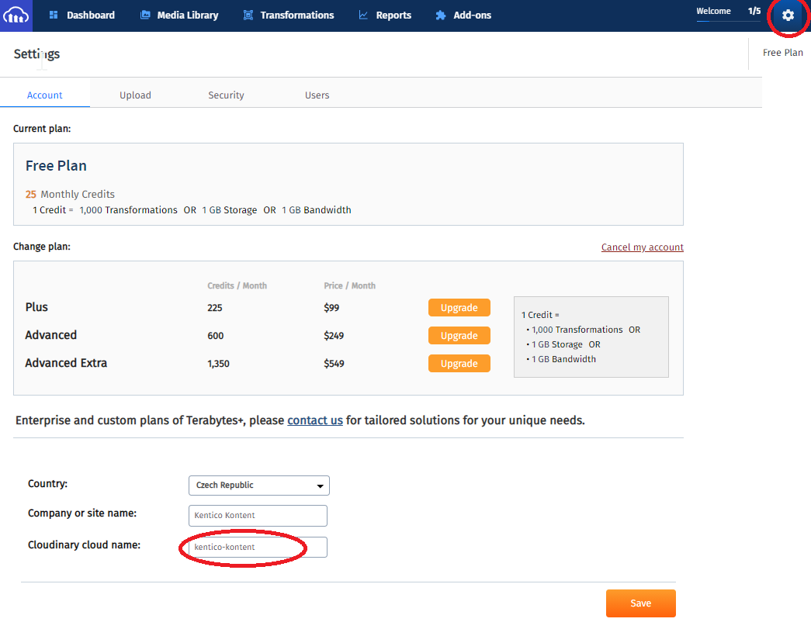
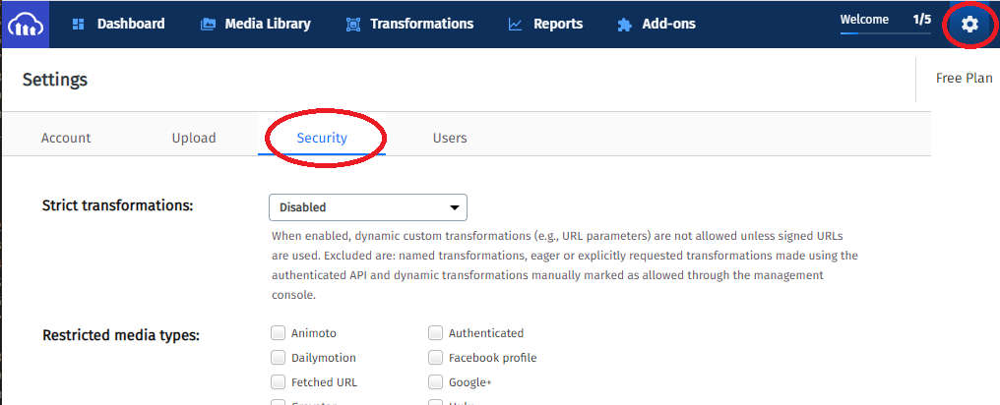

[![Core integration][core-shield]](https://kontent.ai/integrations/cloudinary)
[![Gallery][gallery-shield]](https://kentico.github.io/kontent-custom-element-samples/gallery/)

![Last modified][last-commit]
[![Issues][issues-shield]][issues-url]
[![Contributors][contributors-shield]][contributors-url]
[![Forks][forks-shield]][forks-url]
[![MIT License][license-shield]][license-url]

[![Stack Overflow][stack-shield]](https://stackoverflow.com/tags/kentico-kontent)
[![GitHub Discussions][discussion-shield]](https://github.com/Kentico/Home/discussions)

<p align="center">
<image src="docs/01-kk-logo-main.svg" alt="kontent logo" width="300" />
<image src="docs/cloudinary_logo.png" 
alt="cloudinary logo" width="400">
</p>

<p align="center">
  <a href="#features">Features</a> •
  <a href="#demo">Demo</a> •
  <a href="#quick-deploy">Deploy</a> •
  <a href="#configuring-the-custom-element">Configuration</a> •
  <a href="#what-is-saved">Saved value</a> •
  <a href="#contributors">Contributors</a> •
  <a href="#license">License</a> •
  <a href="#additional-resources">Resources</a>
</p>

This [custom element](https://docs.kontent.ai/tutorials/develop-apps/integrate/integrating-your-own-content-editing-features) extension for [Kentico Kontent](https://kontent.ai) allows users to link selected assets from their [Cloudinary](https://cloudinary.com/) asset library into their structured content. It also provides editors with the ability to upload and manage their assets directly through the extension.

## Features

- Editors can
  - Search for assets in their Cloudinary Asset Library
  - Link selected assets with their content items with preview directly inside of the Kontent editor
  - Upload & Manage assets directly through from the Kontent editor
  

## Demo

![Demo Animation][product-demo]

## Quick Deploy

Netlify has made this easy. If you click the deploy button below, it will guide you through the process of deploying it to Netlify and leave you with a copy of the repository in your account as well.

[](https://app.netlify.com/start/deploy?repository=https://github.com/Kentico/kontent-custom-element-cloudinary)

## Cloudinary setup
The integration uses [the official Media Library Widget by Cloudinary](https://cloudinary.com/documentation/media_library_widget). In order to access your asset library you'll need a Cloud Name and an API Key for the widget. 

### Getting the Cloudinary Cloud Name
The Cloud Name can be found inside of the **Settings** section in your Cloudinary application. Under the **Account** subsection you'll find the **Cloudinary cloud name** at the bottom of the page.



### Creating a new API Key
Subsequently, you'll have to create an API key for the the widget. You'll find that option in the **Settings** section under the **Security** tab as shown on the image below.

At the bottom of the page you'll find a section called **Acess Keys**. There might be a key already generated for you, otherwise, you'll have to generate a new one through the **Generate New Pair**. This will create a new API Key and an API Secret, but only the Key will be neccessary for the custom element to work.


## Configuring the Custom Element
You will need to add the custom element to a content type filling in the hosted code URL and the following JSON parameters:

```
{
    "cloudName": "<YOUR CLOUDINARY CLOUD NAME>",
    "apiKey": "<YOUR API KEY>"
}
```
The section above explains how to find values for the parameters in the Cloudinary application. 

## What is Saved
Assets selected from Cloudinary are saved as an array of objects.
More details about the individual properties can be found [in the official Cloudinary documentation](https://cloudinary.com/documentation/media_library_widget).

Example custom element value:
```
{
  assets: [
    {
      "public_id": "sample",
      "resource_type": "image",
      "type": "upload",
      "format": "jpg",
      "version": 1511474034,
      "url": "http://res.cloudinary.com/demo/image/upload/v1511474034/sample.jpg",
      "secure_url": "https://res.cloudinary.com/demo/image/upload/v1511474034/sample.jpg",
      "width": 864,
      "height": 576,
      "bytes": 120257,
      "duration": null,
      "tags": [],
      "context": [],
      "created_at": "2017-11-23T21:53:54Z",
      "derived": [
        {
          "url": "http://res.cloudinary.com/demo/image/upload/c_scale,e_grayscale,f_auto,q_auto,w_100/v1511474034/sample.jpg",
          "secure_url": "https://res.cloudinary.com/demo/image/upload/c_scale,e_grayscale,f_auto,q_auto,w_100/v1511474034/sample.jpg"
        }
      ]
    }
  ]
}
```

## Contributors
We have collected notes on how to contribute to this project in [CONTRIBUTING.md](CONTRIBUTING.md).

Originally created by <a href="https://www.truelime.nl/">TrueLime</a>

<a href="https://github.com/Kentico/kontent-custom-element-cloudinary/graphs/contributors">
  
</a>

## License

[MIT](https://tldrlegal.com/license/mit-license)

## Additional Resources

- [Custom Element Gallery on github](https://kentico.github.io/kontent-custom-element-samples/gallery/)
- [Kentico Kontent's Integration documentation](https://docs.kontent.ai/tutorials/develop-apps/integrate/integrations-overview)
- [Custom Element documentation](https://docs.kontent.ai/tutorials/develop-apps/integrate/content-editing-extensions)
- [Custom Element API reference](https://docs.kontent.ai/reference/custom-elements-js-api)


[last-commit]: https://img.shields.io/github/last-commit/Kentico/kontent-custom-element-cloudinary?style=for-the-badge
[contributors-shield]: https://img.shields.io/github/contributors/Kentico/kontent-custom-element-cloudinary.svg?style=for-the-badge
[contributors-url]: https://github.com/Kentico/kontent-custom-element-cloudinary/graphs/contributors
[forks-shield]: https://img.shields.io/github/forks/Kentico/kontent-custom-element-cloudinary.svg?style=for-the-badge
[forks-url]: https://github.com/Kentico/kontent-custom-element-cloudinary/network/members
[stars-shield]: https://img.shields.io/github/stars/Kentico/kontent-custom-element-cloudinary.svg?style=for-the-badge
[stars-url]: https://github.com/Kentico/kontent-custom-element-cloudinary/stargazers
[issues-shield]: https://img.shields.io/github/issues/Kentico/kontent-custom-element-cloudinary.svg?style=for-the-badge
[issues-url]: https://github.com/Kentico/kontent-custom-element-cloudinary/issues
[license-shield]: https://img.shields.io/github/license/Kentico/kontent-custom-element-cloudinary.svg?style=for-the-badge
[license-url]: https://github.com/Kentico/kontent-custom-element-cloudinary/blob/master/LICENSE
[core-shield]: https://img.shields.io/static/v1?label=&message=core%20integration&color=FF5733&style=for-the-badge
[gallery-shield]: https://img.shields.io/static/v1?label=&message=extension%20gallery&color=51bce0&style=for-the-badge
[stack-shield]: https://img.shields.io/badge/Stack%20Overflow-ASK%20NOW-FE7A16.svg?logo=stackoverflow&logoColor=white&style=for-the-badge
[discussion-shield]: https://img.shields.io/badge/GitHub-Discussions-FE7A16.svg?logo=github&style=for-the-badge
[product-demo]: docs/demo.gif?raw=true